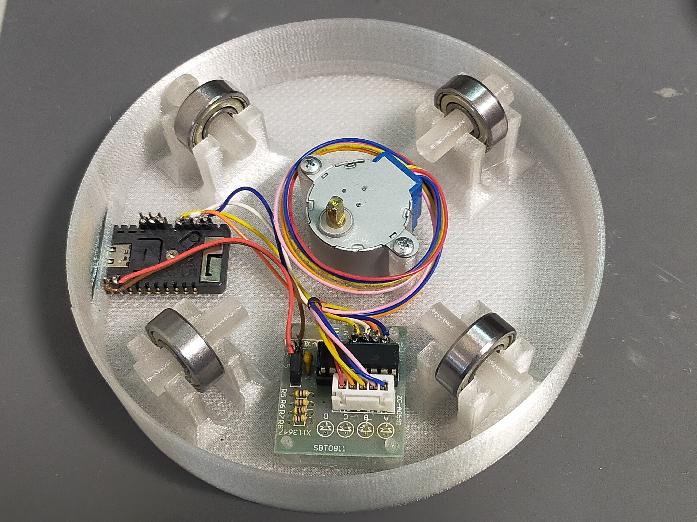

# Mini_Turntable
A mini turntable by using M5StampC3(table) and M5Dial(controler)

## Video (posted on X a.k.a. twitter)

https://x.com/tomorrow56/status/1796848167931240661

https://x.com/tomorrow56/status/1711952006208946181

https://x.com/tomorrow56/status/1711740530798034978

https://x.com/tomorrow56/status/1712617922659803621

## Parts List

### Stepper and Driver: 28BYJ-48+ULN2003

https://amzn.to/3tZpjtQ

### M5StampC3

https://shop.m5stack.com/products/m5stamp-c3-5pcs

### M5Dial

https://docs.m5stack.com/en/core/M5Dial

### Ball Bearing: 608ZZ(8mm x 22mm x 7mm)

https://amzn.to/3SoyaiG

### 3D data (stl)

https://www.printables.com/model/634903-mini-turn-table-28byj-48-with-ball-bearing

## Wiring
|Stepper|StampC3|
|-------|-------|
|STP_IN1|4|
|STP_IN2|5|
|STP_IN3|6|
|STP_IN4|7|

